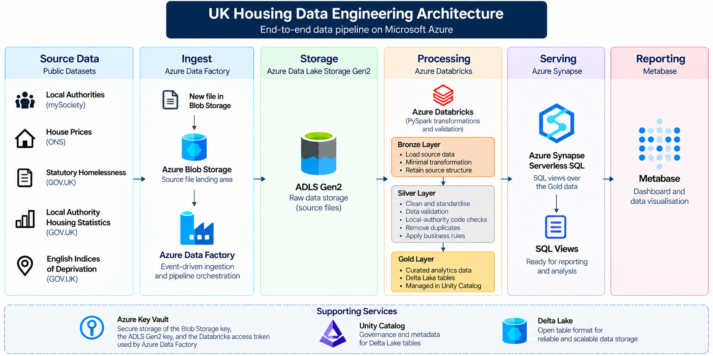

# UK Housing Data Engineering

An end-to-end UK housing data engineering project built using Microsoft Azure.

The project brings together multiple public housing datasets and processes them through an automated data pipeline. Data is ingested using Azure Data Factory, stored in ADLS Gen2, transformed and validated in Azure Databricks using PySpark and Delta Lake. The resulting Gold data is accessed through Synapse Serverless SQL and used by Metabase for reporting and visualisation.

The main focus of the project is the data engineering pipeline: ingestion, transformation, validation, standardisation and preparation of data for analytics.

## Architecture



The pipeline follows this flow:

**Public Datasets → Azure Blob Storage → Azure Data Factory → ADLS Gen2 → Databricks Bronze/Silver/Gold → Synapse Serverless SQL → Metabase**

## Technologies

- Azure Data Factory
- Azure Blob Storage
- Azure Data Lake Storage Gen2
- Azure Databricks
- PySpark
- Delta Lake
- Unity Catalog
- Azure Key Vault
- Azure Synapse Serverless SQL
- Metabase
- Git / GitHub

## Source Data

The project uses five public datasets covering UK housing and local-authority information:

- Local Authorities
- House Prices
- Statutory Homelessness
- Local Authority Housing Statistics
- English Indices of Deprivation

The datasets come from public sources including GOV.UK, the Office for National Statistics and mySociety.

## Documentation

Detailed project documentation covering the data sources, Azure Data Factory pipeline, Databricks processing, data validation, Gold tables, Synapse Serverless SQL and Metabase is available in the [Project Documentation](Documentation/project-documentation.md).

## Data Pipeline

Azure Data Factory uses a Blob Created event trigger to detect new source files.

The filename is passed to the pipeline as a parameter and used by a Switch activity to route the file to the appropriate Databricks notebook.

The main ingestion flow is:

**Blob Storage → ADF Event Trigger → ADLS Gen2 Raw → Databricks → Gold**

## Databricks Processing

The data is processed using a Bronze, Silver and Gold structure.

### Bronze

Source data is loaded and prepared with minimal transformation while retaining the important source values.

### Silver

Data is cleaned, standardised and validated. This includes data type conversion, column naming, local-authority code validation, duplicate checks and source-specific quality rules.

### Gold

The final analytics-ready tables are created in the Gold layer using Delta Lake.

Gold tables use Delta `MERGE` operations to update existing records or insert new records without creating duplicates when processing is rerun.

## Gold Tables

| Table | Records |
|---|---:|
| `dim_local_authority` | 366 |
| `fact_house_prices` | 296 |
| `fact_homelessness` | 296 |
| `fact_lahs` | 296 |
| `fact_imd` | 296 |
| `la_code_mapping` | 2 |

## Data Quality

Validation is applied during the Databricks processing stages.

Examples include:

- Null and blank checks
- Duplicate checks
- Local-authority code validation
- Numeric validation
- Range checks
- Source-specific validation rules
- Local-authority code consistency checks
- Homelessness duty reconciliation

Validation failures raise an exception and prevent invalid data from being written to the target layer.

## Synapse Serverless SQL

The Gold Delta tables are exposed through Azure Synapse Serverless SQL views.

The views provide a SQL layer between the Gold data and Metabase without creating a separate serving copy of the data.


## Metabase

Metabase connects to the Synapse Serverless SQL views and provides the reporting layer for the project.

The dashboard includes visualisations covering:

- Median house prices
- IMD scores
- Homelessness duty households
- House price and IMD comparison


## Engineering Decisions

- Used an event-driven ADF pipeline so new source files can trigger ingestion automatically.
- Used Bronze, Silver and Gold layers to separate source preparation, cleaning and analytics-ready data.
- Used Delta `MERGE` operations to support reruns without creating duplicate Gold records.
- Created a local-authority mapping table to handle two authority-code changes between source datasets.
- Used Azure Key Vault for the Databricks access token used by ADF.
- Used Synapse Serverless SQL views directly over the Gold data.

## Repository Structure

```text
UK_Housing_Data_Engineering/
│
├── README.md
├── Architecture/
├── ADF/
├── Databricks/
├── ADLS/
├── BLOB Storage/
├── Key Vault/
├── Unity catalog/
├── Synapse/
├── Metabase/
└── Documentation/
